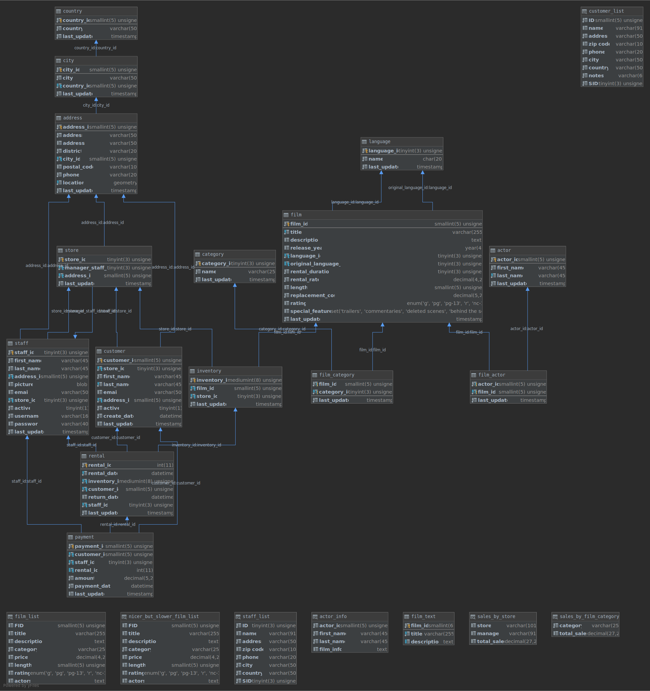

# 1maa/sakila:latest

The [Sakila sample database](https://dev.mysql.com/doc/sakila/en/sakila-introduction.html) loaded on `mysql:8.1`.


## Sample Usage

```
$ docker run -d -e MYSQL_ROOT_PASSWORD=root -p 127.0.0.1:3306:3306 --name sakila 1maa/sakila:latest
```

## Schema


